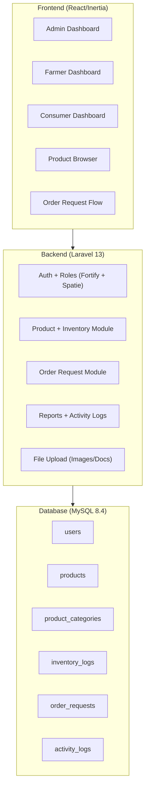

# Farmstock: Digital Inventory Platform -- Implementation Plan

## Current State

The codebase is a **Laravel 13 + Inertia/React + Fortify** starter. What exists today:

- Auth scaffolding (login, register, forgot password, 2FA, email verification)
- A single `User` model with no domain fields
- A blank dashboard page at `/dashboard`
- Settings pages (profile, security, appearance)
- Docker + MySQL compose stack, GitHub Actions deploy pipeline

**Nothing domain-specific exists yet.** All farm/inventory/consumer/order logic needs to be built from scratch.

---

## Architecture Overview

---

## Phase 0: Foundation and Housekeeping

Before building features, fix the infrastructure inconsistencies and lay the groundwork.

### 0.1 -- Fix DB config drift

The `docker-compose.yml` uses MySQL but `.env.docker.example` and docs reference PostgreSQL. Align everything to **MySQL 8.4** (which is what compose already uses). Update `.env.docker.example` to use `DB_CONNECTION=mysql` and port `3306`.

### 0.2 -- Install role/permission package

Install **Spatie Laravel Permission** (`spatie/laravel-permission`). This gives you a battle-tested roles and permissions system. Define three roles: `admin`, `farmer`, `consumer`.

### 0.3 -- Add `role` seeding to `DatabaseSeeder`

Seed the three roles and create one admin user for development.

### 0.4 -- Extend User model + registration

- Add domain fields to `users` migration: `address`, `contact_number`, `farm_name` (nullable, farmer-only), `farm_details` (nullable), `avatar` (nullable).
- Update the Fortify `CreateNewUser` action to accept a `role` field during registration (defaulting to `consumer`; `admin` only assignable by another admin).
- Update the registration React page to include role selection (Farmer vs Consumer) and conditional farm fields.

### 0.5 -- Build role-based middleware and dashboard routing

Create middleware that redirects users to their role-specific dashboard after login:

- `/admin/dashboard`
- `/farmer/dashboard`
- `/dashboard` (consumer)

**Key files touched:** [routes/web.php](routes/web.php), [app/Models/User.php](app/Models/User.php), [app/Actions/Fortify/CreateNewUser.php](app/Actions/Fortify/CreateNewUser.php), new migration, [database/seeders/DatabaseSeeder.php](database/seeders/DatabaseSeeder.php)

---

## Phase 1: Admin -- System Reference Data

The admin panel is the backbone. Build it first so you can manage categories, units, and statuses that the farmer module depends on.

### 1.1 -- Product Categories (CRUD)

- **Migration:** `product_categories` table (`id`, `name`, `description`, `is_active`, timestamps)
- **Model:** `ProductCategory`
- **Controller:** `Admin\ProductCategoryController`
- **Pages:** `resources/js/pages/admin/categories/` -- index (data table), create/edit (form)

### 1.2 -- Units of Measure (CRUD)

- **Migration:** `units` table (`id`, `name`, `abbreviation`, `is_active`, timestamps)
- **Model:** `Unit`
- **Controller:** `Admin\UnitController`
- **Pages:** `resources/js/pages/admin/units/`

### 1.3 -- Status Definitions (CRUD)

- **Migration:** `statuses` table (`id`, `name`, `type` enum: product/inventory/order, `color`, `is_default`, timestamps)
- **Model:** `Status`
- **Controller:** `Admin\StatusController`
- **Pages:** `resources/js/pages/admin/statuses/`

### 1.4 -- User Account Management

- **Controller:** `Admin\UserController` -- list all users, approve/deactivate accounts, assign/remove roles
- **Pages:** `resources/js/pages/admin/users/` -- index with filters (role, status), edit modal
- Uses Spatie permission package to manage roles

### 1.5 -- Admin Dashboard

- Summary cards: total users (by role), total products, pending order requests, recent activity
- Chart: orders over time (use a lightweight chart lib like Recharts, already compatible with the React stack)

---

## Phase 2: Farmer -- Products and Inventory

### 2.1 -- Product Registration

- **Migration:** `products` table (`id`, `farmer_id` FK, `category_id` FK, `name`, `description`, `unit_id` FK, `price`, `status_id` FK, `is_active`, timestamps, soft deletes)
- **Model:** `Product` with relationships to User (farmer), ProductCategory, Unit, Status
- **Controller:** `Farmer\ProductController`
- **Pages:** `resources/js/pages/farmer/products/` -- index (data table with search/filter), create, edit, show
- **Policy:** `ProductPolicy` -- only the owning farmer can edit/delete

### 2.2 -- Product Image Upload

- **Migration:** `product_images` table (`id`, `product_id` FK, `path`, `is_primary`, `sort_order`, timestamps)
- **Model:** `ProductImage`
- Use Laravel's filesystem with a `products` disk (local or S3-compatible)
- Accept JPG, JPEG, PNG; validate size; generate thumbnails
- React: drag-and-drop image uploader component, reorder, set primary

### 2.3 -- Inventory Management

- **Migration:** `inventory_logs` table (`id`, `product_id` FK, `quantity_change`, `quantity_after`, `reason`, `logged_by` FK, timestamps)
- Add `current_stock` column to `products` table (denormalized for fast reads)
- **Controller:** `Farmer\InventoryController` -- update stock (add/subtract), view history
- **Pages:** `resources/js/pages/farmer/inventory/` -- stock overview grid, update modal, history timeline
- Every stock change creates an `inventory_log` entry for auditability

### 2.4 -- Farmer Dashboard

- My products count, low-stock alerts, incoming order requests count
- Recent inventory changes timeline
- Quick-action buttons: "Add Product", "Update Stock"

---

## Phase 3: Consumer -- Browse and Order

### 3.1 -- Product Browsing (Public/Auth)

- **Controller:** `Consumer\ProductBrowseController`
- **Pages:** `resources/js/pages/products/` -- index (card grid with category filter, search, sort by price/date), show (product detail with images, farmer info, stock availability)
- Accessible to authenticated consumers (and optionally as a public catalog on the landing page)

### 3.2 -- Order Request Submission

- **Migration:** `order_requests` table (`id`, `consumer_id` FK, `farmer_id` FK, `status_id` FK, `notes`, `total_amount`, timestamps)
- **Migration:** `order_request_items` table (`id`, `order_request_id` FK, `product_id` FK, `quantity`, `unit_price`, `subtotal`, timestamps)
- **Model:** `OrderRequest`, `OrderRequestItem`
- **Controller:** `Consumer\OrderRequestController` -- create, view own requests
- **Pages:** order form (from product detail or cart-like flow), my requests list with status badges
- **Policy:** consumers can only view their own requests

### 3.3 -- Order Request Handling (Farmer side)

- **Controller:** `Farmer\OrderRequestController` -- view incoming requests, accept/reject/mark as completed
- **Pages:** `resources/js/pages/farmer/orders/` -- incoming requests list, detail view with accept/reject actions
- When a farmer accepts, stock is decremented and an inventory log is created
- Status transitions: Pending -> Accepted -> Completed / Rejected

### 3.4 -- Consumer Dashboard

- My recent order requests with statuses
- Quick-browse section showing recently listed or featured products

---

## Phase 4: Reporting and Activity Logs

### 4.1 -- Activity Logging

- **Migration:** `activity_logs` table (`id`, `user_id` FK, `action`, `model_type`, `model_id`, `description`, `ip_address`, `properties` JSON, timestamps)
- **Model:** `ActivityLog`
- Use a trait `LogsActivity` on key models (Product, OrderRequest, User) that auto-logs create/update/delete events
- Or integrate the `spatie/laravel-activitylog` package for a mature solution

### 4.2 -- Report Generation

- **Admin reports:** user statistics, inventory summaries across all farmers, order request volume, system activity
- **Farmer reports:** my product inventory summary, order history, stock movement report
- **Controller:** `ReportController` (scoped by role)
- **Pages:** `resources/js/pages/reports/` -- filter by date range, export to CSV/PDF
- For PDF export, use `barryvdh/laravel-dompdf`

### 4.3 -- Admin Activity Monitor

- Admin page showing the activity log stream with filters (user, action type, date range)
- Link from dashboard summary cards to filtered log views

---

## Phase 5: Polish and Evaluation-Ready

### 5.1 -- Notification system

- Notify farmers when they receive a new order request (database + optional email)
- Notify consumers when their order request status changes
- Use Laravel's built-in notification system with a database channel
- React: notification bell in the nav bar

### 5.2 -- Security hardening

- Enable email verification (uncomment `MustVerifyEmail` on User model)
- Rate limiting on order submissions
- CSRF already handled by Inertia
- Input sanitization and file upload validation

### 5.3 -- System settings (Admin)

- A key-value `settings` table for toggleable system behavior: enable/disable registration, max upload size, order request limits, etc.
- Admin settings page

### 5.4 -- Landing page

- Replace the starter `welcome` page with a proper marketing/landing page showcasing the platform, its features, and a call to register
- Show a public product catalog preview

### 5.5 -- Testing

- Feature tests for each major flow (registration by role, product CRUD, inventory updates, order lifecycle)
- Build on the existing Pest test setup in [tests/](tests/)

---

## Suggested Build Order (Summary)

| Order   | What                                     | Why                                                |
| ------- | ---------------------------------------- | -------------------------------------------------- |
| Phase 0 | Foundation (roles, user fields, routing) | Everything depends on roles                        |
| Phase 1 | Admin reference data + user management   | Farmers need categories/units to register products |
| Phase 2 | Farmer products + inventory              | Core domain -- the system's reason to exist        |
| Phase 3 | Consumer browsing + order requests       | Depends on products existing                       |
| Phase 4 | Reports + activity logs                  | Needs data from phases 1-3                         |
| Phase 5 | Polish, notifications, landing page      | Final layer before evaluation                      |

Each phase is independently demonstrable -- you can show progress to your adviser after each one.
